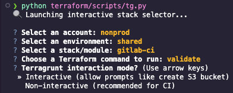

# Python Scripts

Quick way to access terraform/terragrunt commands without needing to `cd` into directories.

## Usage

`python terraform/scripts/<file.py> -a <account> -e <environment> -f <folder> -c <command> [--run-all] [--dry-run] [--log-level <level>]`

| Flag                  | Description                                                     | Example                         |
|-----------------------|-----------------------------------------------------------------|---------------------------------|
| `-a` / `--account`    | Target account (e.g., `nonprod`, `prod`)                        | `-a nonprod`                    |
| `-e` / `--env`        | Target environment folder                                       | `-e dev`                        |
| `-f` / `--folder`     | Optional: Specific module/folder inside env                     | `-f sqs-lambda-demo`            |
| `-c` / `--command`    | Terraform command (`init`, `plan`, `apply`, `destroy`, etc)     | `-c plan`                       |
| `--run-all`           | Use `terragrunt run-all` instead of a single module run         | `--run-all`                     |
| `--non-interactive`   | Run Terragrunt in non-interactive mode (useful for automation)  | `--non-interactive`             |
| `--parallelism`       | Max number of modules to process in parallel with run-all       | `--parallelism 4`               |
| `--dry-run`           | Show what would be executed, but don’t actually run anything    | `--dry-run`                     |
| `--log-level`         | Terragrunt log verbosity (`trace`, `debug`, `info`, `warn`, `error`) | `--log-level error`        |
| `--extra-args`        | Additional arguments passed directly to Terragrunt              | `--extra-args -lock=false`      |

Without arguments you'll get walked thru a wizard.



## About

All paths referenced below have `terragrunt.hcl` or `run-all` ability multi-module with dependencies.
Makes use of SSM Parameter Store for credential pools, network or other parameters, or `common.hcl` for sharing across multi-module.

This script just removes the need to change directory (`cd`) into these locations as this could accommodate multi-account/multi-environment in AWS.

## Dealing with AWS Account(s)

Util methods added to support for account id lookup:

- `terraform/environments/nonprod-12345678910/`
- `terraform/environments/prod-12345678911/`

or fallback to;

- `terraform/environments/nonprod/account_id.txt`
- `terraform/environments/prod/account_id.txt`

Will check if you have defaults and use that. (~/.aws/credentials)
Evaluates your ~/.aws/config to match account to profile.

## SQS Lambda Demo

Sample Long running task:  REST endpoint for adding a task.  A Runner picks it up out of SQS processes it.

```shell
python terraform/scripts/tg.py -a nonprod -e dev -f sqs-lambda-demo -c plan --run-all

👉 Running: terragrunt run-all plan in terraform/environments/nonprod/dev/sqs-lambda-demo
23:07:26.849 INFO   The stack at . will be processed in the following order for command plan:
Group 1
- Module ./dynamodb
- Module ./sqs

Group 2
- Module ./role

Group 3
- Module ./lambda_task
- Module ./lambda_task_runner

Group 4
- Module ./api_gateway
```

## ECS Fargate Demo

Sample serverless setup for docker containers on fractional compute/memory with autoscaling, scheduling.

```shell
python terraform/scripts/tg.py -a nonprod -e dev -f ecs-fargate-demo -c plan --run-all;

👉 Running: terragrunt --terragrunt-log-level=info run-all plan in terraform_structure/terraform/environments/nonprod/dev/ecs-fargate-demo
23:39:47.557 INFO   The stack at . will be processed in the following order for command plan:
Group 1
- Module ./cluster
- Module ./security_group
- Module ./services/service-a/codedeploy_role
- Module ./services/service-a/ecr
- Module ./services/service-a/task_execution_role
- Module ./services/service-a/task_role

Group 2
- Module ./alb
- Module ./services/service-a/task_definition

Group 3
- Module ./services/service-a/route53
- Module ./services/service-a/security_group
- Module ./services/service-a/target_group

Group 4
- Module ./services/service-a/ecs_service

Group 5
- Module ./services/service-a/codedeploy
```

## WebApp Single Page Demo

Frameworks like VueJS, Angular 2+ etc for serverless (Cloudfront/S3)

```shell
python terraform/scripts/tg.py -a nonprod -e dev -f webapp-spa-demo -c plan --run-all

👉 Running: terragrunt --terragrunt-log-level=info run-all plan in terraform_structure/terraform/environments/nonprod/dev/webapp-spa-demo
23:40:53.048 INFO   The stack at . will be processed in the following order for command plan:
Group 1
- Module ./s3_cloudfront

Group 2
- Module ./route53
```

## Shared (multi-env resources at account)

### RDS

AWS Aurora Serverless V2

```shell
python terraform/scripts/tg.py -a nonprod -e shared -f rds -c plan --run-all
```

### AWS CodeBuild Github Runner

AWS now allows you to run a **CodeBuild** runner to **execute Github Actions** in AWS.  Works via webhook back to your Github

```shell
python terraform/scripts/tg.py -a nonprod -e shared -f codebuild-github-runner -c plan --run-all
```

### AWS Codebuild Gitlab Runner

AWS now allows you to run a **CodeBuild** runner to **execute Gitlab-CI** in AWS.  Works via webhook back to your Gitlab.

```shell
python terraform/scripts/tg.py -a nonprod -e shared -f codebuild-gitlab-runner -c plan --run-all
```

### Gitlab CI Runner (EKS)


This module provisions a GitLab CI Runner that runs on **EKS** (Elastic Kubernetes Service), using a **bastion EC2 instance** to initiate builds and manage lifecycle operations from within the VPC.

```shell
python terraform/scripts/tg.py -a nonprod -e shared -f gitlab-ci -c plan --run-all
```
